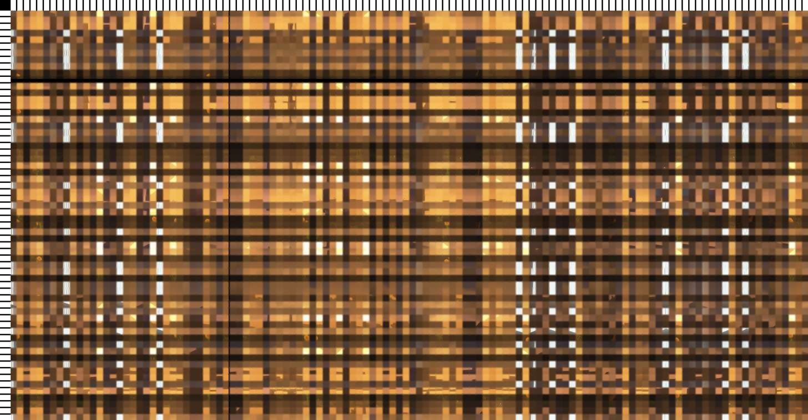
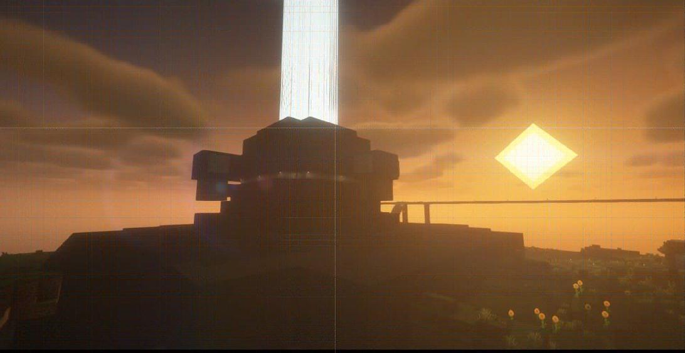

# 抗压缩图片混淆

本混淆算法使用图片标尺解决压缩大小带来的坐标错位问题。

## 使用

```sh
python -m pip install -r requirements.txt
python __main__.py
```

## 示例

示例均使用默认设置：


缩放 1/2，质量 50：

 → 

我们发现只是因为强行打破像素连续性，导致压缩后出现了噪点。这可以通过加粗网格，增加缓冲避免。

图上的白线可以通过调整阈值消除。
