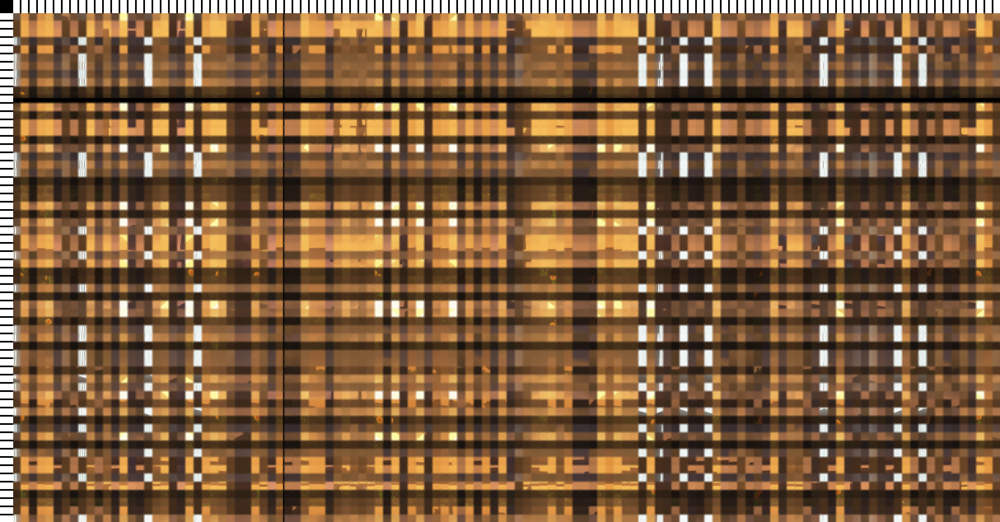
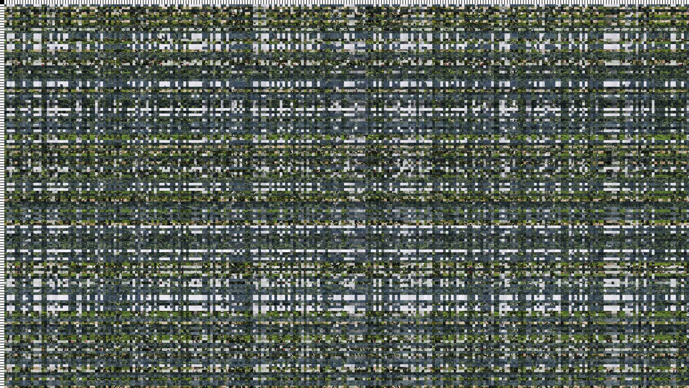
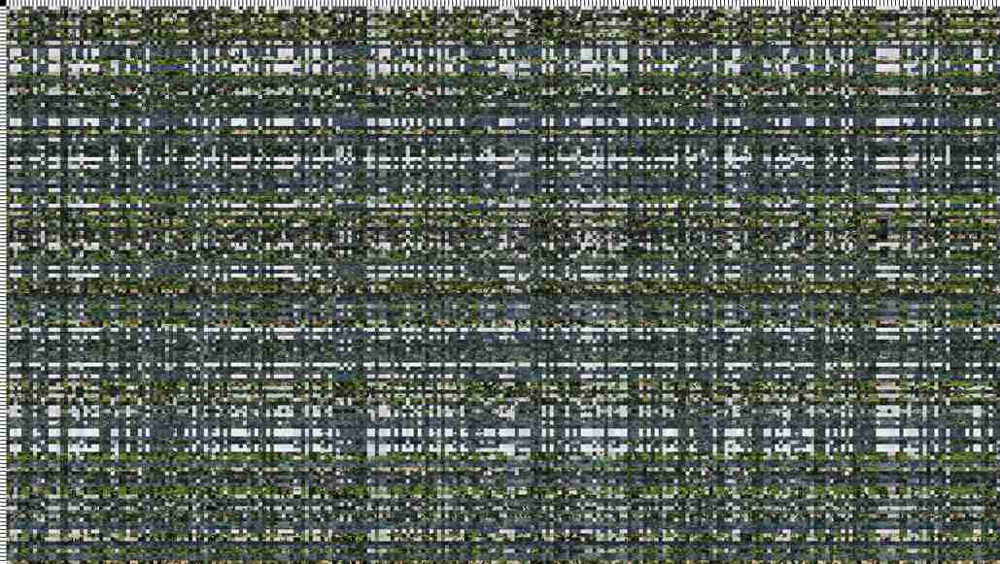
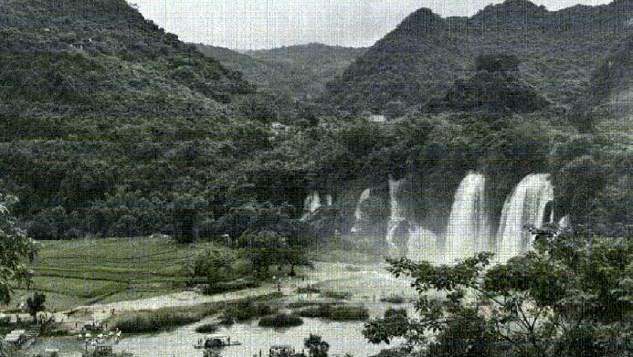

# 抗压缩图片混淆

本混淆算法使用图片标尺解决压缩大小带来的坐标错位问题。

## 使用

```sh
python -m pip install -r requirements.txt
python __main__.py
```

## 示例

示例均使用默认设置：




缩放 50%，质量 50，默认设置：

 → 

全损画质，缩放 20%，质量 20：

 → 

> [!CAUTION]
> 待解混淆图片的左上角必须为标尺。
> 标尺头及至少 2 个相邻标尺必须未被损坏。
